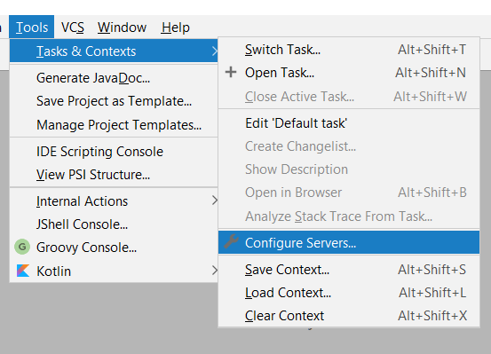
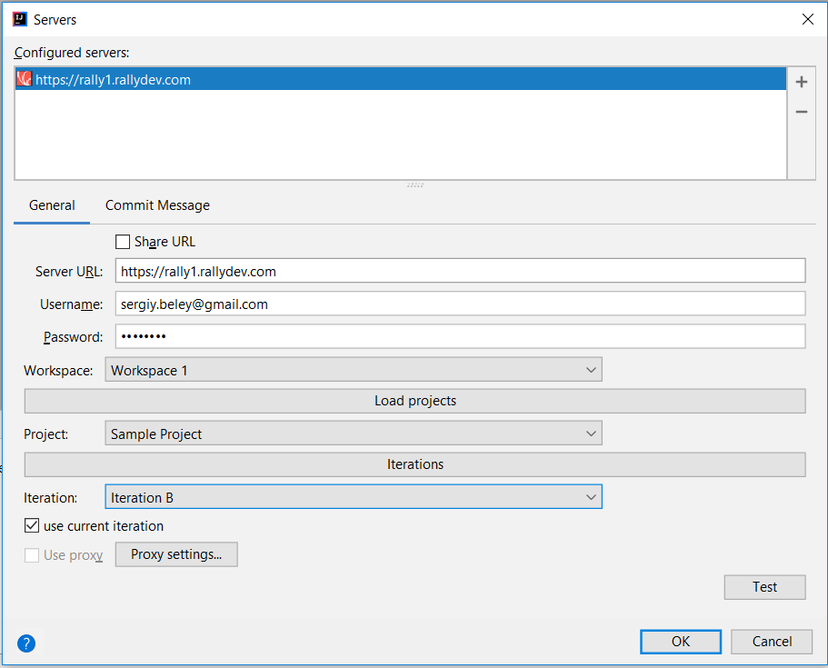
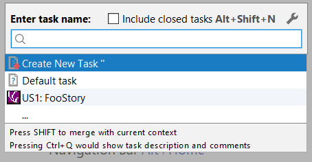

# Rally plugin for Intellij
Implements Intellij's Agile ALM integration.

## How to use

1. In IDEA open "Tools / Tasks & Contexts / Configure Servers..."

2. Press "+" and select "Rally"
3. Define Server URL: "https://rally1.rallydev.com"

4. Define your Username and Password
5. Press "Test connection"
6. Now you may select Workspace, Project and Iteration(It may be required to close this dialog and open it again, or press "Load projects", "Iterations")
7. Now you may switch task contexts by selection "Tools / Tasks & Contexts /Switch task" or "Tools / Tasks & Contexts /Open task" 

8. On a right corner of your IDE you'll see your task name

## Implementation details

1. Forked from: https://github.com/RallySoftware/intellij-plugin
2. Ported from groovy on java. Heavily reworked.
3. To work with Rally I used original Rally java api from: https://github.com/RallyTools/RallyRestToolkitForJava
4. [REMOVED] Also I created helper library which take hides a lot of boilerplate code: https://github.com/crc83/rally-api-helper
5. All API from rally-api-helper is here. Build updated with latest gradle plugin to develop IDEA plugins (funny).

# How to build

1. Use Gradle 5.1 or newer
2. run "gradle test" to run tests
3. run "gradle runIde" to launch IDEA with this plugin installed

# Licence
This plugin is distributed under MIT licence. You may find it here:
http://opensource.org/licenses/MIT

# Releases
## 1.1
1. Reworked build process.
2. Added documentation regarding "How to build"
3. Added documentation regarding "How to use"

## 1.0
date: 12-september-2013
at: http://dl.bintray.com/crc83/generic/rallydev.zip
